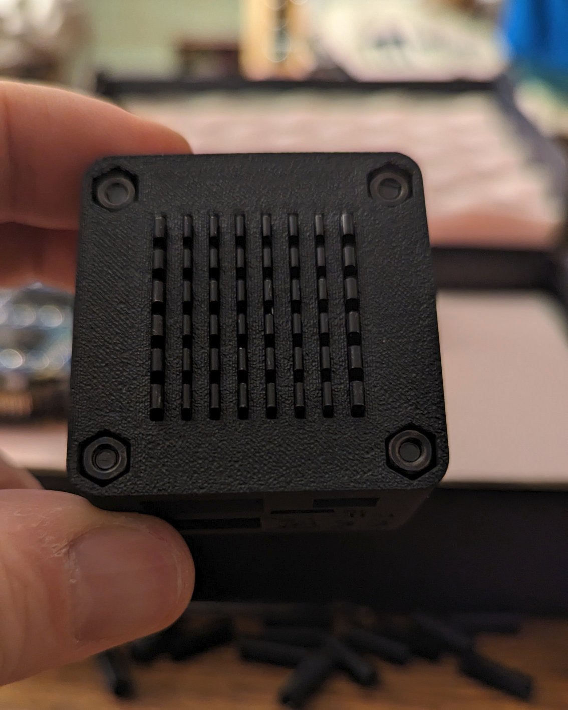

# Montage
## Abstandhalter
{: style="width:500px"}

Legen sie die NanoPi NEO Core Platine vor sich.

{: style="width:500px"}

Stecken sie den Abstandhalter wie abgebildet auf die Header-Pins.

{: style="width:500px"}

Schieben sie den Abstandhalter mit einem schmalen Gegenstand mittig bis zum Ende nach unten.

{: style="width:500px"}

Der Abstandhalter sollte nun auf dem SD-Karten-Halter aufliegen.

## NanoHat Power
{: style="width:500px"}

Legen sie den Akku des NanoHat Power auf die NanoPi Platine wie abgebildet zwischen die Header-Pins.

{: style="width:500px"}

Stecken sie das NanoHat Power wie abgebildet auf die NanoPi Header-Pins.
Achten sie darauf, dass das Akku-Kabel möglichst gerade und am Pin-Header des NanoPi vorbei verläuft.

## NanoHat OLED
{: style="width:500px"}

Stecken sie das NanoHat OLED wie abgebildet auf die NanoPi Platine, aber drücken sie die beiden Teile noch nicht komplett zusammen.

{: style="width:500px"}

Führen sie das Akku-Kabel an der Audio-Buchse vorbei

{: style="width:500px"}

Schieben sie den Akku bis zum Anschlag in das Sandwitch, sodass dieser möglichst wenig herausragt.

{: style="width:500px"}

Entfernen sie die Schutzfolie des NanoHat OLED.
## Kühlkörper
{: style="width:500px"}

Lösen sie wie abgebildet eine Ecke der Klebeabdeckung vom Kühlkörper ab.

{: style="width:500px"}

Setzen sie den Kühlkörper mittig in die untere Gehäusehälfte.

{: style="width:500px"}

Drücken sie den Kühlkörper durch die Schlitze fest an.

{: style="width:500px"}

Lösen sie die Klebeabdeckung komplett ab.

## Abstandsbolzen
{: style="width:500px"}

Setzen sie die Abstandsbolzen mit der flachen Seite zu den Pin-Headern in das Sandwitch ein. Drücken sie anschließend das Sandwitch zusammen.

## Unteres Gehäuse
{: style="width:500px"}

Setzen sie das Sandwitch wie abgebildet in die untere Gehäusehälfte ein. Die Anschlüsse zeigen nach hinten. Achten sie darauf, dass das Sandwitch so weit wie möglich an die hintere Gehäusewand gedrückt wird, damit vorn genug Platz für den Schiebeschalter bleibt.

{: style="width:500px"}

Schieben sie das Sandwitch zunächst nur so weit hinein, dass der Akku mit der oberen Kante der unteren Gehäusehälfte abschließt.
## Oberes Gehäuse und Knöpfe
{: style="width:500px"}

Legen sie die obere Gehäusehälfte wie abgebildet vor sich.

{: style="width:500px"}

Setzen sie die Knöpfe wie abgebildet in die untere Gehäusehälfte ein.

## Zusammenführen
{: style="width:500px"}

Drehen sie die untere Gehäusehälfte mit dem Sandwitch um und legen es wie abgebildet auf die obere Gehäusehälfte, sodass die Knöpfe und Displayausschnitt deckungsgleich mit dem NanoHat OLED Board sind.

{: style="width:500px"}

Setzen sie nun den Schiebeschalter zuerst in die obere Gehäusehälfte ein. Achten sie darauf, dass sie ihn gekippt in die Führung einführen und dass sich der Nippel des Schalters auf dem NanoHat Power Board in die Aussparung des Schiebeschalters einfügt. Gehen sie sehr behutsam vor, da der Nippel sonst abbrechen könnte.

{: style="width:500px"}

Drehen sie den Bausatz wie abgebildet um.

{: style="width:500px"}

Drücken sie nun behutsam und abwechselnd vor und hinten über die obere Gehäusehälfte das Sandwitch vollständig in die untere Gehäusehälfte.

{: style="width:500px"}

Achten sie am Ende darauf, dass die Nuten der Gehäusehälften sich ineinander fügen.

## Verschrauben
{: style="width:500px"}

Beginnen sie beim Verschrauben mit einem der beiden vorderen Schraublöcher. Führen sie die 30mm M3 Torx Senkkopfschraube in die Bohrung ein. Sollte die Schraube verkanten, wackeln sie ein wenig. Sie muss bis zum Anschlag eingeführt werden.

{: style="width:500px"}

Setzen sie von der gegenüberliegenden Seite die M3 Mutter entsprechend ein.

{: style="width:500px"}

Drücken sie die beiden Gehäusehälften fest zusammen, fixieren sie dabei die Mutter mit einem Finger. Verschrauben sie die erste Schraube mit 2-3 Gewindegängen.

{: style="width:500px"}

Fahren sie nun mit der Schraube diagonal zur ersten fort. Die hinteren Schrauben lassen sich aufgrund der innen liegenden Abstandsbolzen schwerer einführen, arbeiten sie hier mit etwas mehr Nachdruck. Auch die Verschraubung ist bei den hinteren Schrauben schwergängiger.

{: style="width:500px"}

Es folgt die zweite hintere Verschraubung.

{: style="width:500px"}

Und zuletzt die zweite vordere Verschraubung.

{: style="width:500px"}

Ziehen sie die Schrauben abschließend über kreuz fest an. Die Schraube sollte wie abgebildet mit der Mutter abschließen.

## Überprüfen
{: style="width:500px"}

Schalten sie den Schiebeschalter auf die linke Stellung (Akku-Betrieb). Es sollte nun auf der linken Seite die grüne LED erleuchten.

{: style="width:500px"}

Auf der Rückseite sollte eine rote LED leuchten.

{: style="width:500px"}

Überprüfen sie den SD-Karten-Schlitz.

## Abschluss
{: style="width:500px"}

Decken sie das Display mit der Schutzfolie ab.